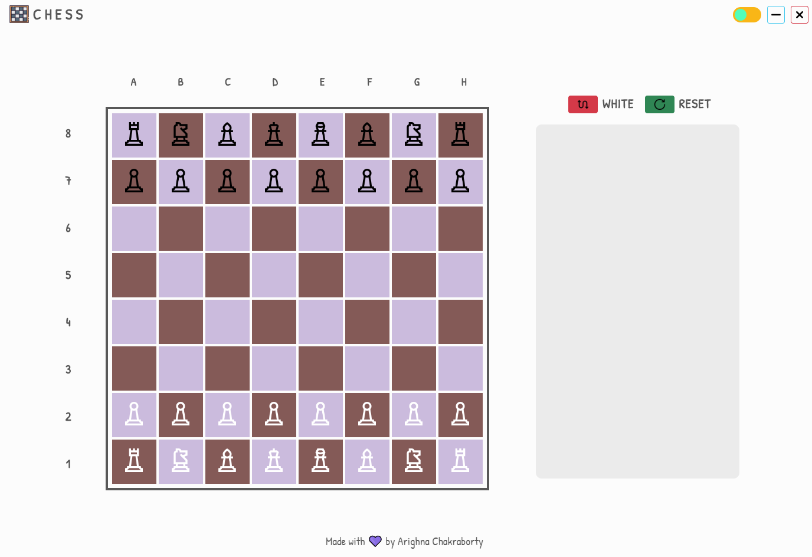
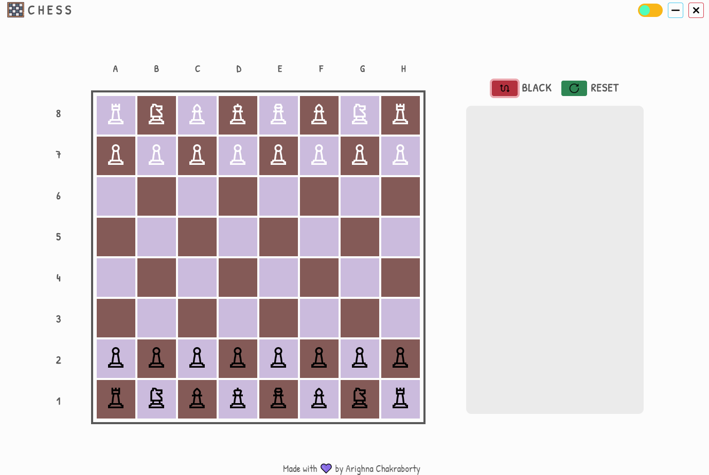
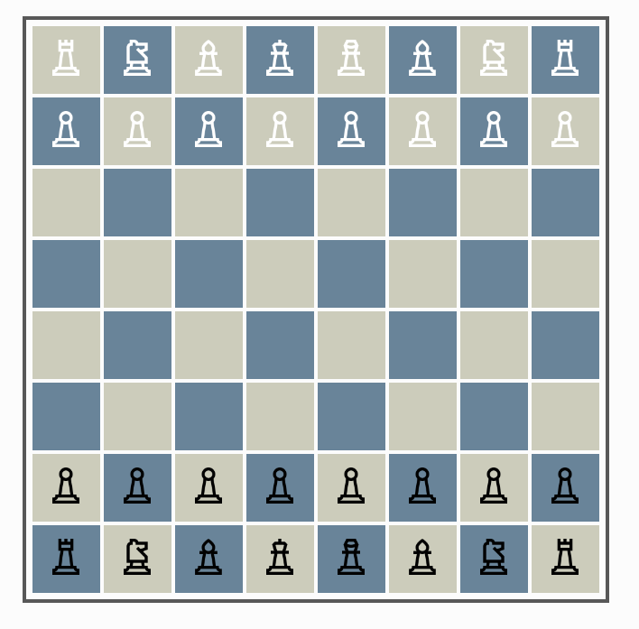
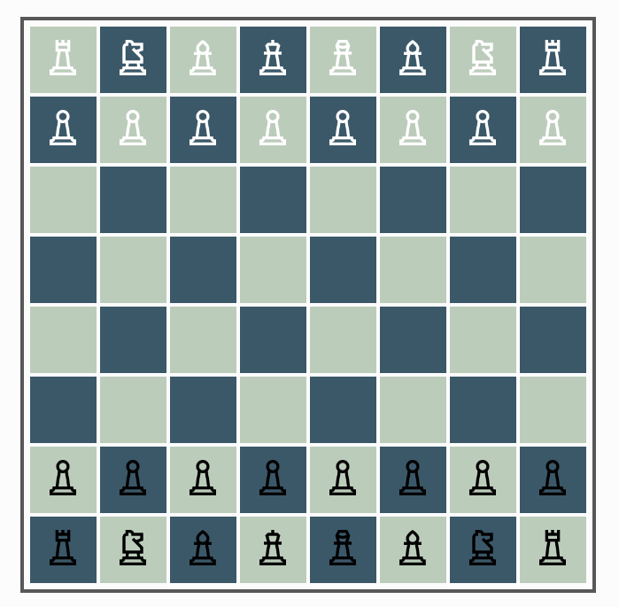
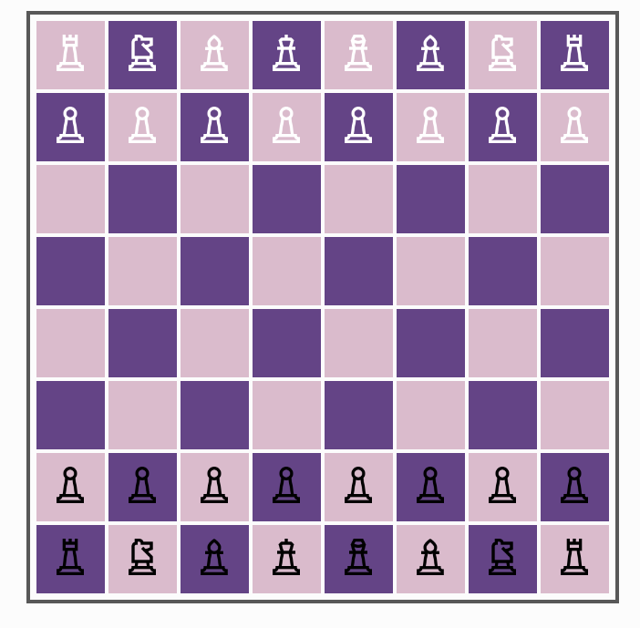
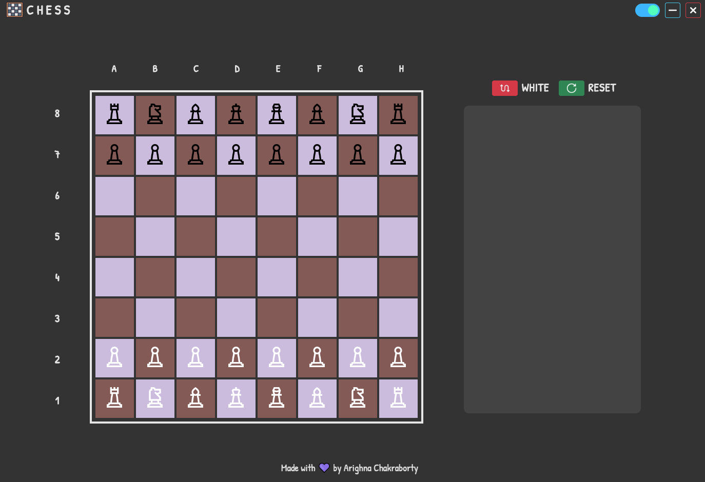

# Chess
A Simple Chess Engine with a beautiful GUI

# Features
- Beautiful GUI 
<div align="center">
    
     
</div>

- A different Chessboard everytime !
<div align="center">
    
    
    
    
</div>

- Dark Mode! 
<div align="center">
    
</div>

## To-do
:white_check_mark: Responsive UI\
:white_check_mark: Add Piece Exclusive Moves\
:white_check_mark: Add Special Moves\
:white_check_mark: Add AI Opponent

If you have any suggestions feel free to open an issue.

# Requirements

- Dual Core or Equivalent Processor
- 1 Gb RAM recommended
- Win 8 or higher recommended
- In case of Win 7, .NET Framework 4.7.1 or higher is required .NET 4.6.1 has black screen issue.

# Install npm _must_
You need to install Nodejs first which can be found here:
[NodeJs](https://nodejs.org)

# Install electron _must_
Just open your project folder and type in your CLI,
```
npm i -D electron@latest
```

## Build

- See the [`electron-builder` docs](https://www.electron.build/multi-platform-build).
- Recommended for electron-builder [`Yarn`](https://yarnpkg.com/en/docs/install#windows-stable)
- Create a `build` folder inside your project folder and copy the `chess.ico` from `assets` folder
- Install electron-builder
```
yarn add electron-builder --dev
```
- Open your CLI and type
```
yarn dist
```
- Install setup and enjoy

# Donate

If you like my work you could donate me via [`Paypal`](https://www.paypal.me/rijustone).
It would really help me. Thanks.
